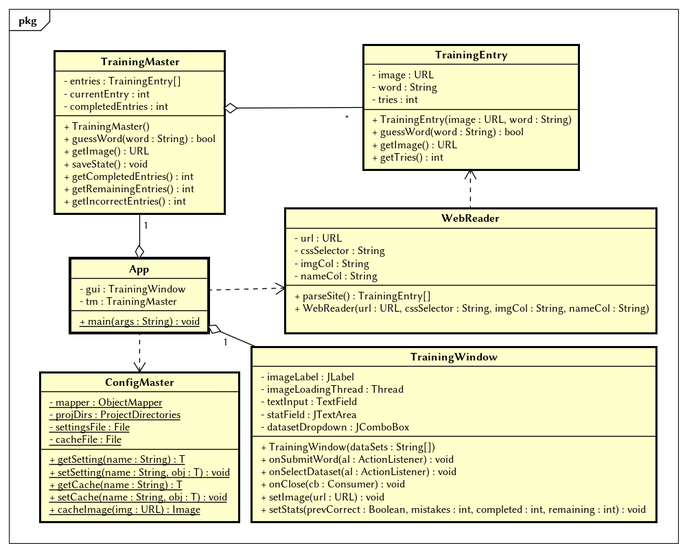

## Worttrainer Riedlered

weil der Riedler schon wieder extraideen hat

### Beschreibung

Der Worttrainer liest Daten aus einer Wikipedia-Tabelle und gibt ein Dictionary mit der url vom bild und dem Namen vom Objekt zurück.

Geplant ist [jene](https://de.wikipedia.org/wiki/Liste_der_Staaten_Europas) Tabelle mit den Namen der Länder, logischerweise.

### Aufbau

